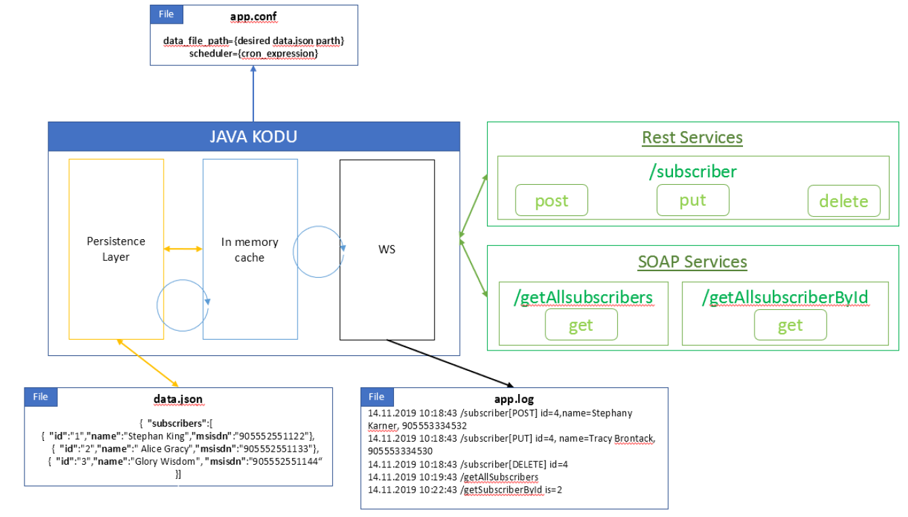

# EJavaPrototype Project

This project is a backend project developed in Java by using Spring Boot framework.

***Dependencies***: 
* Java version 1.8
* Spring Boot version 2.5.3
* Maven version 3.6.3

### Project Architecture
The project architecture consists of the following modules as shown in the figure.

* ***Persistence Layer:*** Handles data file read/write operations
* ***In memory cache:*** Saves and orchestrate data operation during application runtime life cycle
* ***Web Service:*** Contains REST API and SOAP WS endpoints to act as client interfaces
* ***Scheduler:*** Operates based on provided cron expression to sync cache data to data file
* ***Log:*** Logs all the requests coming to web service endpoints



### Prerequisities and Configuration
* `app.conf` file must be created in the following path `C:\ericsson-java-prototype\conf`
  * An example app.conf file can be found in `src/main/resources/static/app.conf`
  * The template of the app.conf file must be as shown in the following example.
    
   ```sh
   data_file_path={C:/ericsson-java-prototype/data/data.json}
   scheduler={*/10 * * * * *}
   ```
   
   *  Data file path and cron expression should be written between curly braces.
   *  `data_file_path` and `scheduler` parameters shouldn't be changed.
   
* Filling the data file is optional but the data format should be as follows if it will be filled
 ```sh 
  {
  "subscribers": [
  {"id":"1","name":"Stephan King","msisdn":"905552551122"},
  {"id":"2","name":" Alice Gracy","msisdn":"905552551133"},
  {"id":"3","name":"Glory Wisdom", "msisdn":"905552551144"}
  ]
  }
```

* The log file is produced and located in `C:\ericsson-java-prototype\log\app.log` once the application is started.


### Build and Run Project
In order to build and run the project in your locale run the following commands.

```sh
$ mvn clean package
```

```sh
$ mvn spring-boot:run
```

### Running Application from .jar file
Once package building is completed a `executable fat .jar` is exported to project's target folder. The application can also be up by running the fat .jar with providing the `app.properties` file as a spring config file argument. (To do that the app.properties file shall be moved to /target folder and the following command shall be run from the directory)

```sh
$ java -jar -Dspring.config.file=app.properties ericsson-java-prototype-0.0.1-SNAPSHOT.jar
```

### Web service endpoints
* REST Services:
  * POST: http://localhost:8080/subscriber
    * Request: 
      ```sh
      {
      "id": "1001",
      "name": "Nikola Tesla",
      "msisdn": "+905552551122"
      }
      ``` 
   * PUT: http://localhost:8080/subscriber
      * Request: 
        ```sh
        {
        "id": "1001",
        "name": "Albert Einstein",
        "msisdn": "+905552551123"
        }
        ``` 
    * DELETE: http://localhost:8080/subscriber
        * Request: 
          ```sh
          {
          "id": "1001"
          }
          ``` 
          
* SOAP Services:
  * WSDL: http://localhost:8080/subscriber-data/subscribers.wsdl 
  * getAllSubscribers:
      * Request: 
        ```sh
         <soapenv:Envelope xmlns:soapenv="http://schemas.xmlsoap.org/soap/envelope/" xmlns:ser="http://www.ericsson.com/java/prototype/soap/services">
           <soapenv:Header/>
           <soapenv:Body>
              <ser:getAllSubscribersRequest/>
           </soapenv:Body>
        </soapenv:Envelope>
        ```
        
  * getSubscriberById:
      * Request: 
        ```sh
        <soapenv:Envelope xmlns:soapenv="http://schemas.xmlsoap.org/soap/envelope/" xmlns:ser="http://www.ericsson.com/java/prototype/soap/services">
           <soapenv:Header/>
           <soapenv:Body>
              <ser:getSubscriberByIdRequest>
                 <ser:id>1001</ser:id>
              </ser:getSubscriberByIdRequest>
           </soapenv:Body>
        </soapenv:Envelope>
        ```
